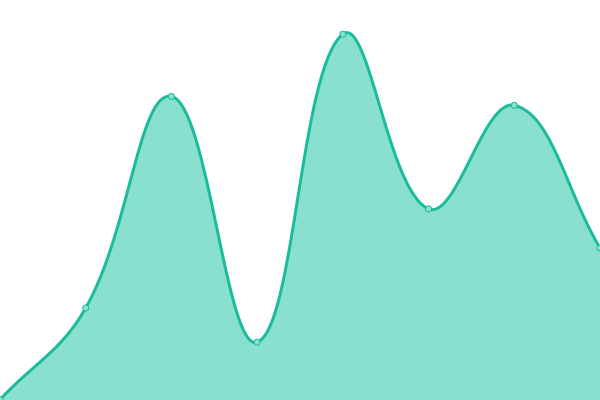
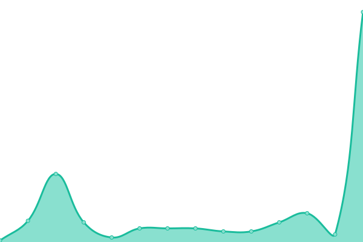

# [📈 Live Status](https://uptime.myviewboard.com): <!--live status--> **🟩 All systems operational**

This repository contains the open-source uptime monitor and status page for [myViewBoard](https://uptime.myviewboard.com), powered by [Upptime](https://github.com/upptime/upptime).

With [Upptime](https://upptime.js.org), you can get your own unlimited and free uptime monitor and status page, powered entirely by a GitHub repository. We use [Issues](https://github.com/myViewBoard/upptime/issues) as incident reports, [Actions](https://github.com/myViewBoard/upptime/actions) as uptime monitors, and [Pages](https://uptime.myviewboard.com) for the status page.

<!--start: status pages-->
<!-- This summary is generated by Upptime (https://github.com/upptime/upptime) -->
<!-- Do not edit this manually, your changes will be overwritten -->
<!-- prettier-ignore -->
| URL | Status | History | Response Time | Uptime |
| --- | ------ | ------- | ------------- | ------ |
|  [myViewBoard Wiki](https://wiki.myviewboard.com) | 🟩 Up | [my-view-board-wiki.yml](https://github.com/ViewSonicCloud/myViewBoard-Upptime/commits/HEAD/history/my-view-board-wiki.yml) | 

 1111ms
     
 | 

<a href="https://uptime.myviewboard.com/history/my-view-board-wiki">100.00%</a>
    

|  [myviewboard.com](https://myviewboard.com) | 🟩 Up | [myviewboard-com.yml](https://github.com/ViewSonicCloud/myViewBoard-Upptime/commits/HEAD/history/myviewboard-com.yml) | 

 1243ms
     
 | 

<a href="https://uptime.myviewboard.com/history/myviewboard-com">100.00%</a>
    

|  [myViewBoard Web Service](https://api.myviewboard.com) | 🟩 Up | [my-view-board-web-service.yml](https://github.com/ViewSonicCloud/myViewBoard-Upptime/commits/HEAD/history/my-view-board-web-service.yml) | 

 1326ms
     
 | 

<a href="https://uptime.myviewboard.com/history/my-view-board-web-service">100.00%</a>
    

<!--end: status pages-->

[**Visit our status website →**](https://uptime.myviewboard.com)

## 📄 License

- Powered by: [Upptime](https://github.com/upptime/upptime)
- Code: [MIT](./LICENSE) © [myViewBoard](https://uptime.myviewboard.com)
- Data in the `./history` directory: [Open Database License](https://opendatacommons.org/licenses/odbl/1-0/)
